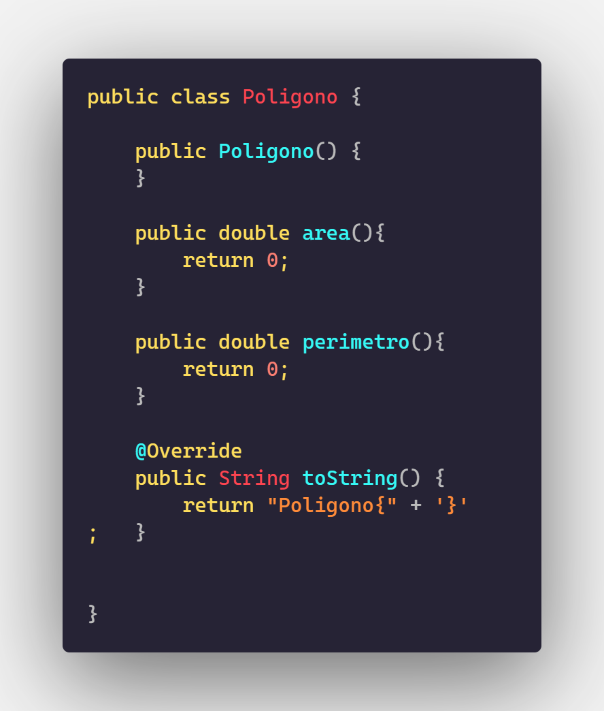
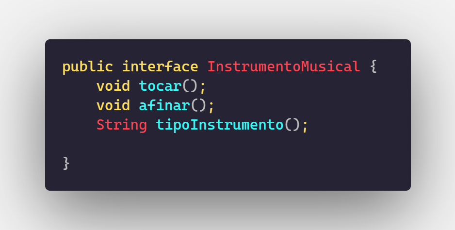
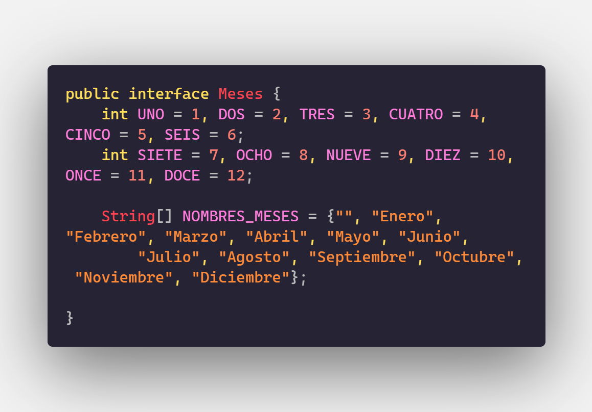

>Authors: 
>Rosillo Montijo Emmanuel Alonso, García Cardenas Fabián, Méndez Maldonado Jorge, Jimenez Flores Jose Emanuel
# POLIMORFISMO
## Clases Abstractas
### - Poligono
Creamos como ejemplo principal esta clase:

<center>
<br>
</center>


Respecto a esta clase incluimos a triangulo y cuadrilatero

```java
public class Cuadrilatero extends Poligono{
    private float a,b, base, altura;
    private int alfa, beta;

public class Triangulo extends Poligono{
    private int alfa, beta, gama;
    private float a, b, c;
    private float base, altura;
```
podemos visualizar que su clase padre es poligono, ya que poligono se podría decir que es el conjunto de figuras geométricas

## -Interfaces
### -Instrumento de viento:
Utilizamos interfaces para poder **"juntar"**, por así decirlo,  métodos y atributos que tienen en común las clases del programa, ya que nos permite incluir los mismos dentro del cuerpo de la interfaz a crear. por ejemplo:

<center>
<br>
</center>

Por así decirlo, una clasificación de instrumetos es de viento, por lo que se creo aparte una clase para la clasificación de los instrumentos.
```java
public class InstrumentoViento extends Object implements InstrumentoMusical{

    public InstrumentoViento() {
    }
    

    @Override
    public void tocar() {
        System.out.println("Tocando Instrumento");
    }

    @Override
    public void afinar() {
        System.out.println("Afinando instrumento");
    }
```
que se podría decir que estos métodos los tiene todo instrumento de viento
y su propio instrumento específico:
```java
public class Flauta extends InstrumentoViento{
    @Override
    public String tipoInstrumento(){
        return "flauta";
    }

    @Override
    public String toString() {
        return "Flauta{" + '}';
    }   
}
```
cada una con su respectiva herencia.
## - Interfaces como almacenes
Utilizamos una interfaz para que puediera almacenar datos, y a travéz de la misma poder acceder a ellos de la siguiente forma:

<center>
<br>
</center>

almacena el contenido de meses y en el menú principal, accedemos a ellos para imprimirlos:
```java
System.out.println("El mes " + Meses.DOS + " corresponde a " + Meses.NOMBRES_MESES[Meses.DOS]);
```
y de esta forma concluir polimorfismo.